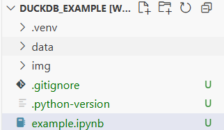

# Example "One-Off" DuckDB Data Analysis Project

> [!CAUTION]  
> Some of the below termainal commands assume Mac/Linux. Translation to Windows OS should be a piece of cake.

**[🔗 Example code here](./example.ipynb).**

## Setup:

1. [Install uv](https://docs.astral.sh/uv/#installation) (only requires one terminal command!)
2. [Install Jupyter add-on for VS Code](https://marketplace.visualstudio.com/items?itemName=ms-toolsai.jupyter)
3. Initialise project folder:
    ```bash
    uv init duckdb_example
    cd duckdb_example
    ```
4. Create `.gitignore`:
    ```bash
    echo .venv/ > .gitignore
    echo .duckdb >> .gitignore
    ```
    ...etc
5. Create `.venv`:
    ```bash
    uv venv
    ```
6. Add initial dependencies:
    ```bash
    uv add duckdb
    uv add ipykernel
    uv add numpy
    uv add pandas
    ```
   ...etc
7. Open project directory in VS Code:
    ```bash
    code .
    ```
8. Create `example.ipynb` file:
    
    

9.  Select `.venv` as kernel:
    - If the "Select Kernel" button appears at the top right of the editor, click it
    - Select "Python Environments"
    - Select your `.venv` file

10. Get coding. 